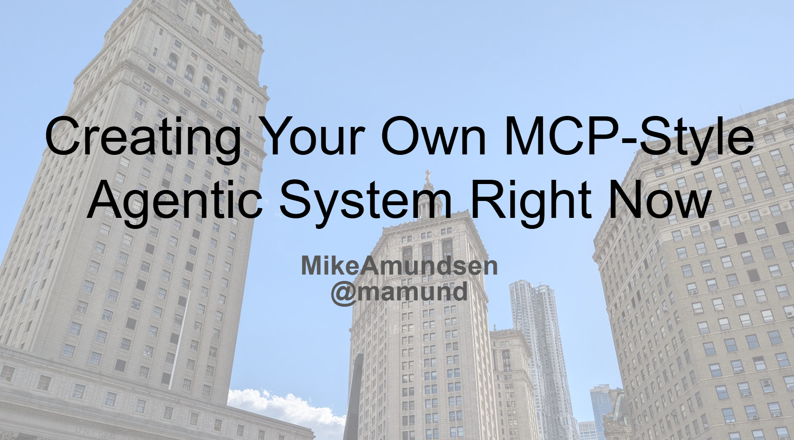

= Creating Your Own MCP-Style Agentic System
:author: Mike Amundsen
:email: mamund@gmail.com

== Overview
Status:: _Delivered 2025-09-30 for https://apiconference.net/new-york/[API Conference NYC 2025]_
Home:: link:index.html[HTML]
Slides:: link:https://mamund.site44.com/talks/2025-09-apicon-nyc/2025-09-apicon-nyc-agentic-slides.pdf[PDF]
Code:: link:https://github.com/mamund/apis-and-agents[Github]
Video:: _NA_
Audio:: _NA_
Transcript:: _NA_

== Abstract
*Creating Your Own MCP-Style Agentic System Right Now*

Many of the core elements of new MCP-style agentic architectures we're seeing emerge are not only possible with current technologies but also already up and running in one form or another in many enterprises today. No matter what we call it — affordance-based, lambda-style, agentic, event-driven — the key to building flexible, stable, and decoupled systems that machines can use on their own usually comes down to the same three elements: Dynamic Service Discovery, Shared Semantic State, Composable Service Interfaces. 

For those who have already been working on creating composable systems that support discovery, shared-state, and stable interfaces, the arrival of MCP and other agent-centric platforms is nothing new. And for those who want to take advantage of the oncoming wave of AI-driven API consumption, investing in the three pillars of composable systems is a great way to set yourself up for success. 

This talk shows a working version of an agentic system you can download and adapt to your environment today.

== Mike Amundsen
Internationally known author and speaker Mike Amundsen consults with organizations around the world on network architecture, Web development, and the intersection of technology & society. He helps companies capitalize on the opportunities provided by APIs, Microservices, and Digital Transformation. 

Amundsen has authored numerous books and papers.  His recent book is "RESTful Web API Patterns and Practices Cookbook" (2022). His "Design and Build Great APIs" (2020) is a popular developer-centric book. Amundsen also contributed to the book, "Continuous API Management" (2020, 2018).  His "RESTful Web Clients", was published in February 2017 and he co-authored "Microservice Architecture" (June 2016).

 * Twitter/x: @mamund
 * Voice: +1.859.757.1449 
 * Email: mamund@gmail.com 
 * Github: http://github.com/mamund
 * YouTube: http://youtube.com/mamund/
 * LinkedIn: http://linkedin.com/in/mamund
 * Presentations: http://mamund.com/talks/
 * Amazon Page: http://amazon.com/author/mamund

